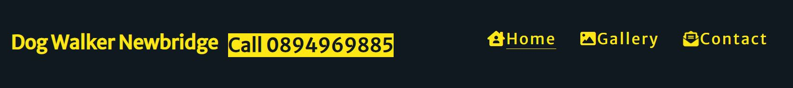
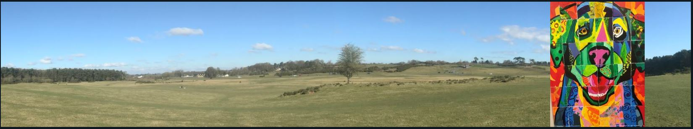
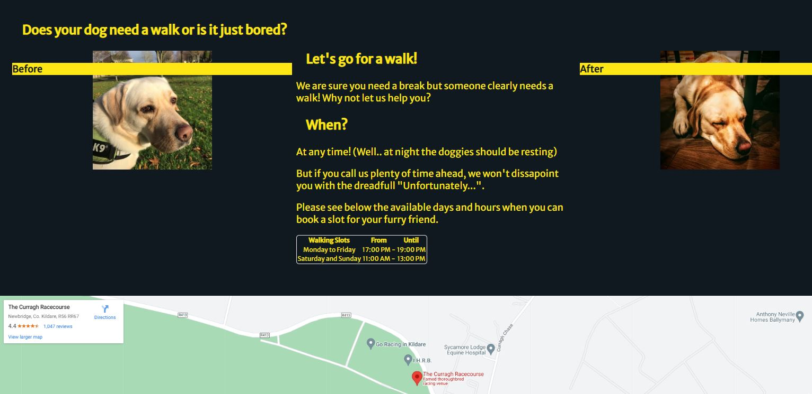
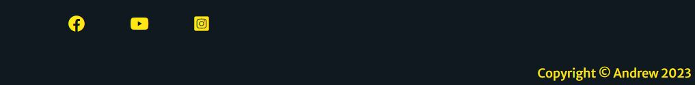
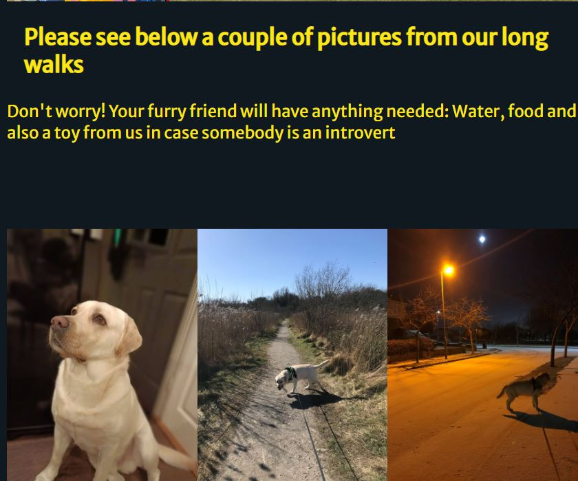
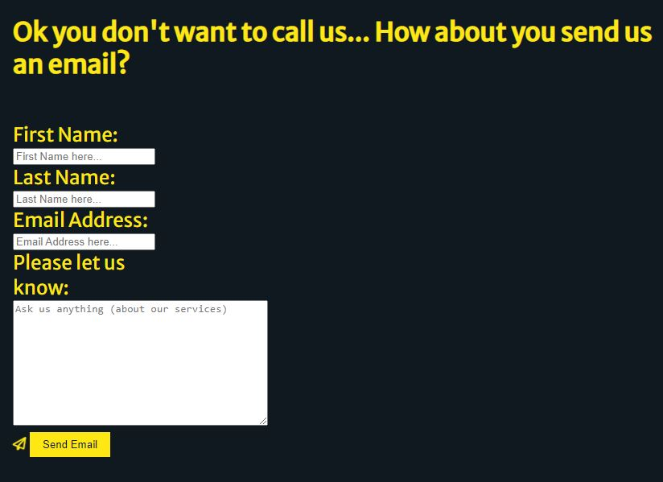
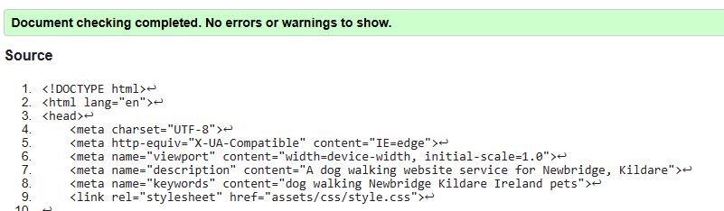
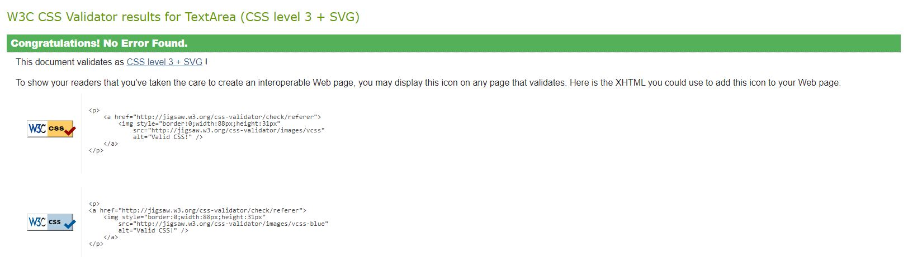
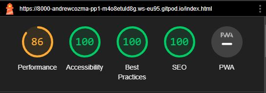

Dog Walker Newbridge Website

This is a website that promotes a dog walking business in Newbridge Kildare.

The website is targeted towards dog owners that would like to book in dog walks. 

Features:

Navigation - at the top right of the corner we can see the name of the business, location and a contact phone number;
           - the rest of the navigation links that are to right will take you to the Gallery and Contact pages; 
           - the colors picked are complementary so that they will look good and appealing for the users;
           - the navigation is clear and user friendly giving all the necessary details for booking a dog walk;
           - I added an anumated bouncing fontawesome icon next to the contact so that it will attract the user's attention and stimulate to contact the company;
           

The Header - is a picture of one of the places where the dog will be taken for a walk (The Curragh)

The Body   - provides details about booking slots;
           - there is also a google maps page with Newbridge location in case the customers are from around the area and need directions;

The Footer - provides the links to all the social media associated to this company and copyrights; 

The Gallery page - shows some of the photos that were taken on the dog walks;

The Contact page - has a form that includes First Name, Last Name, Email address and a text area where the customer can ask any question; When the submit button is clicked on, the user is being taken to a new page that displays a thank you message. 

Testing:

The website has been tested on Chrome and Edge. It is responsive and all the links are working. 
The navigation bar is easy to use and functional. 
The form is also working as intended and it is taking you to a different page that confirms that the communication has been sent. 

Validator Testing:

HTML - Passed the W3C HTML Validation Service with no errors. 

CSS - Passed the W3C CSS Validation Service with no errors. 

Accessibility - Lighthouse test passed. 

Deployment:
The Website has been deplyed to GitHub Pages. Please see below link. 

Credits:

Content:
Pieces of code have been taken from the "Love Running" and "Coffeehouse" Projects.  
      Navigation and Header - inspired from the Love Running project
      Loved that Zoom effect that was on the main picture so this one was also inspired from Love Running.
      The Google Maps section - inspired from the Coffeehouse project
      The Form was adapted after the Code Institute Training. 
      The Colors were taken from webflow.com.
      Certain errors that I was getting were sorted using https://stackoverflow.com
      Google Fonts used for the website fonts. 
      Code for the Icons for the menu have been taken from Fontawesome

